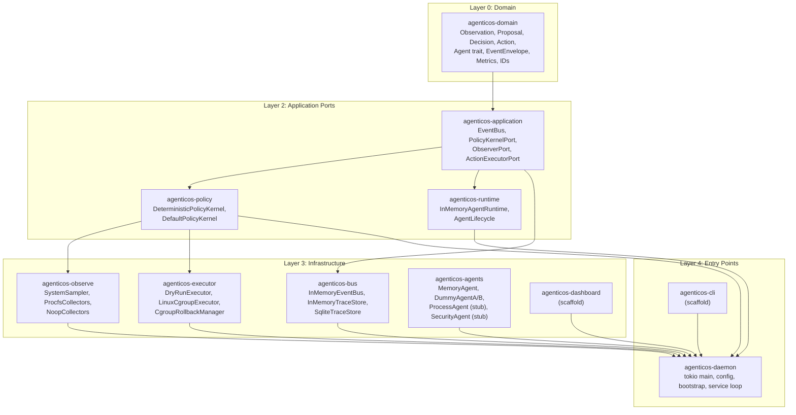
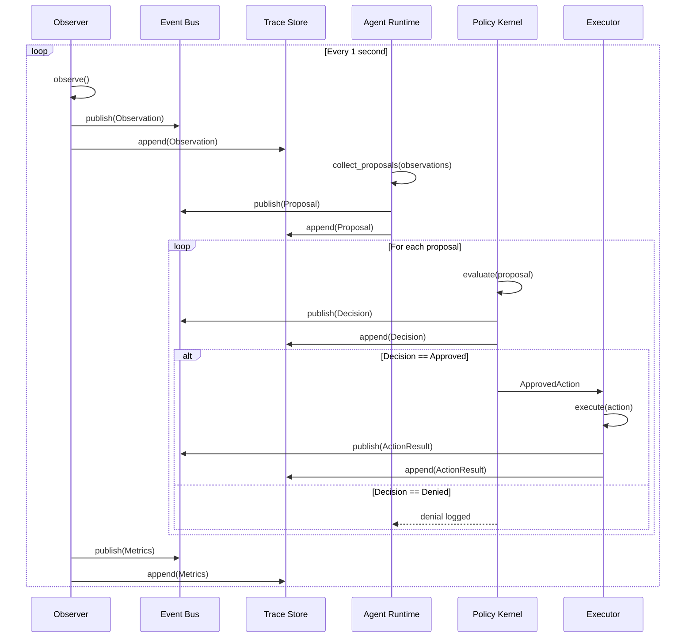
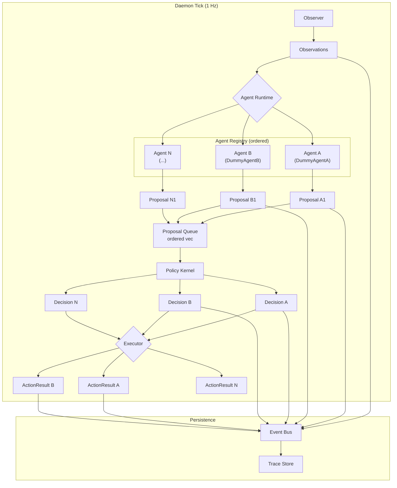
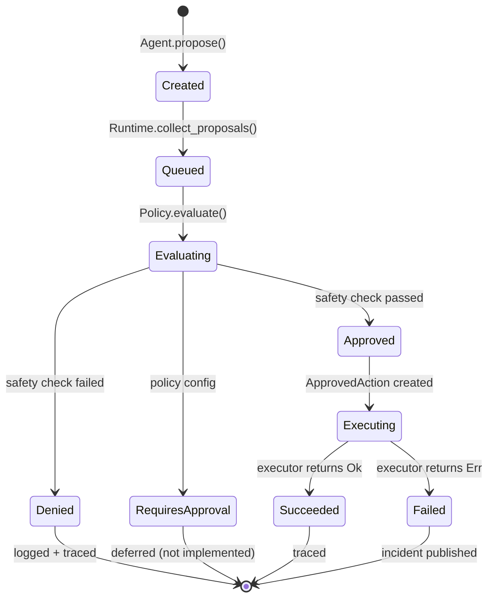
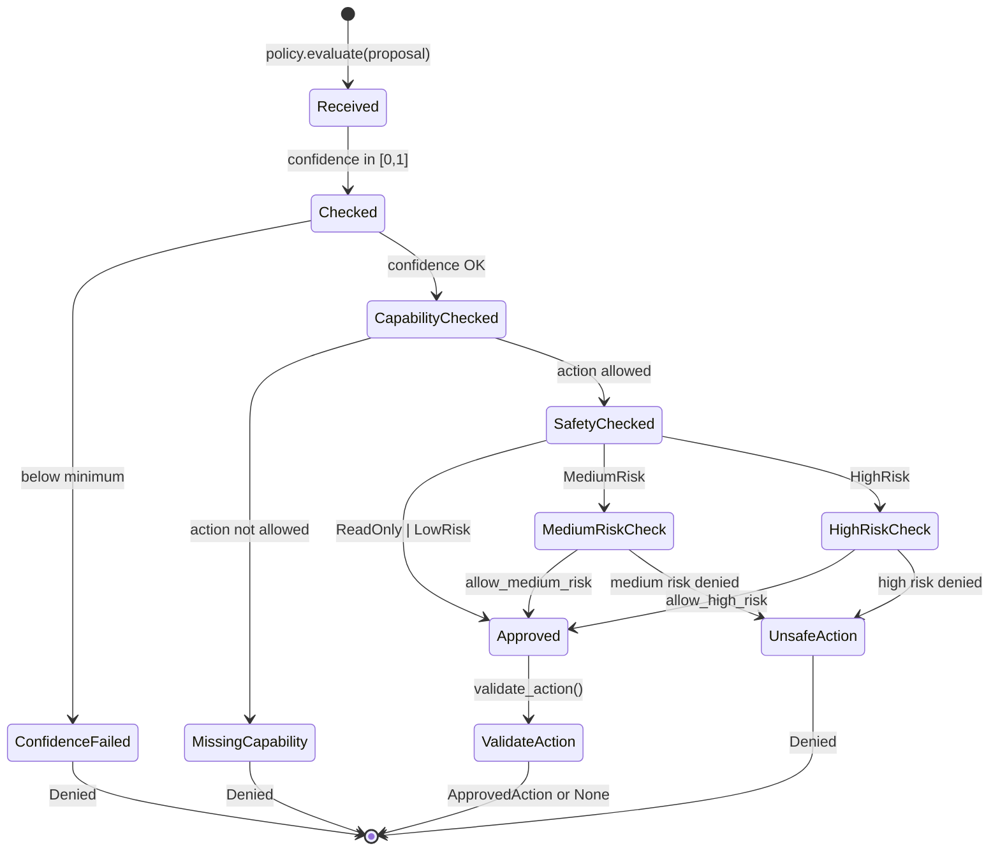
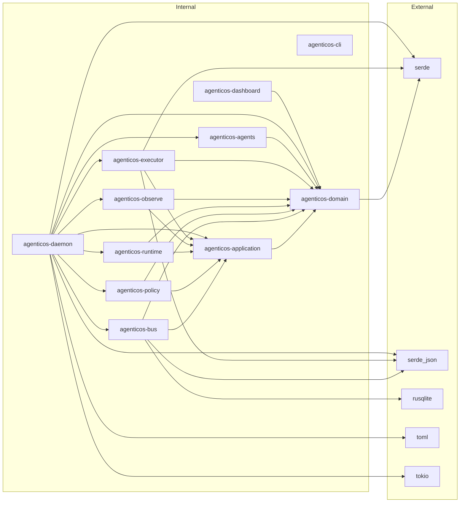

# AgenticOS Architecture (Alpha-1)

**Date:** 2026-06-02  
**Version:** Alpha-1 (Phase 0 scaffold)

---

## Component Architecture



---

## Event Flow



---

## Multi-Agent Coordination



### Coordination Properties

| Property | Implementation |
|----------|---------------|
| **Ordering** | Agents registered in `Vec<AgentId>` → proposals collected in insertion order |
| **Concurrency** | Single-threaded tick loop; no parallel proposal processing |
| **Determinism** | Same observations + same agents + same policy → same decisions |
| **Auditability** | Every event published to bus + persisted to trace store |
| **Isolation** | Agents cannot observe each other's proposals within the same tick |
| **Fairness** | First registered = first processed (no priority inversion) |

---

## Proposal Lifecycle



### Proposal Fields

```rust
Proposal {
    id: ProposalId,              // Unique, auto-generated
    agent_id: AgentId,           // Originating agent
    created_at: String,          // ISO-8601 timestamp
    based_on: Vec<ObservationId>, // Observations that triggered this proposal
    requested_action: ActionRequest,  // What to do
    rationale: String,           // Why (human-readable)
    confidence: Confidence(f32),  // 0.0 – 1.0
}
```

---

## Decision Lifecycle



### Decision Fields

```rust
Decision {
    id: DecisionId,
    proposal_id: ProposalId,
    decided_at: String,
    decided_by: AgentId,         // Always "policy-kernel"
    outcome: DecisionOutcome,    // Approved | Denied { reason } | RequiresApproval
    explanation: String,
}
```

---

## Crate Dependency Graph



---

## Configuration Schema

```toml
[agenticos]
mode = "development"           # safe-local | development | benchmark
event_store = "sqlite"         # sqlite | memory
db_path = "data/agenticos.db"  # SQLite file path
policy = "policies/default.toml"

[safety]
privileged_execution = false   # Future: allow privileged mode
llm_enabled = false            # Future: LLM-based agent reasoning
```
